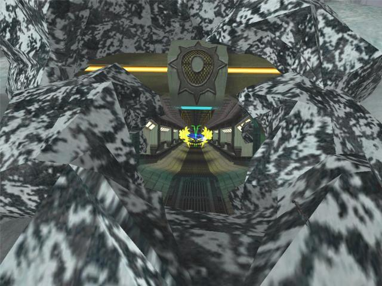
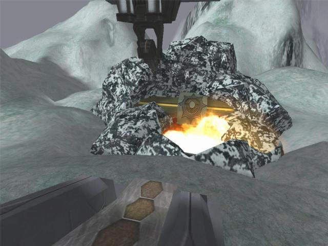
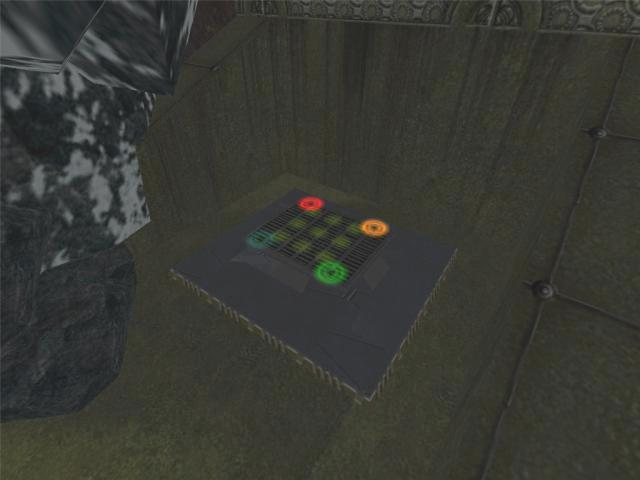
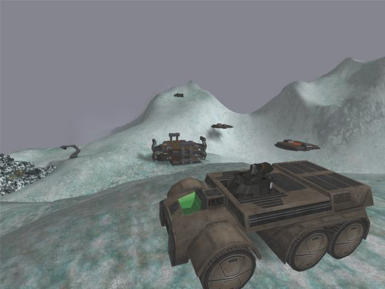

# Shafted

A Siege map for Tribes 2

## Installation

1. Download the [latest release](https://github.com/kfox/non-sequitur/releases/latest/download/Shafted.vl2)
2. Move it to your server's `Tribes2\GameData\base` directory
3. Start the server

## Description

This Siege map "flips the script" by requiring the team on "offense" to repair generators and the team on "defense" to go on the attack. The gameplay is split into two phases.

### Phase One

The offense needs to capture the underground base. However, the only way down is a tunnel blocked by rocks. The offense must repair their Laser Drill and the Drill Generator (or one of the two solar panels) in order to activate the drill. The more gens that are up, the faster the drilling progresses. (The drill gen provides 40% drill power, each solar provides an additional 30%.) The drill itself is very difficult to destroy once it is powered, but it can be taken down with some teamwork. The offense has two MPB's to use as invo stations and immobile turret defense. The defense begins in a base on the opposite side of the map. They must keep the gens and drill disabled as often as possible. (i.e., The defense must constantly attack the offensive assets.) Players firing at the rocks will NOT hasten the drilling process.

If the drill destroys all the rocks, then the second phase begins.

## Phase Two

The waypoints will change and a tone will sound to indicate that the second phase has begun. The defensive spawn moves underground as soon as the second phase begins. There are three gens in the underground base, all initially enabled. The switch (also in the base) is protected by forcefields powered by the three underground gens. Also, the gens power four defensive inventory stations in the underground base.

## Dance for the win

The defense may also "dance" on the "DDR Pad" to power forcefields in the tunnel. (The DDR Pad is hidden in a small cave near the upper entrance to the underground base.) Each hop on a pad will power the respective forcefield for about 7 seconds. Once a tunnel forcefield goes down, the pad may be reactivated. If an enemy steps on an active pad, the respective tunnel forcefield will go down immediately. If the pad is inactive when an offensive player steps on it, the pad will light but nothing else will happen. Each of the tunnel forcefields are "all-pass" forcefields, and they slow everyone equally.

## Images

